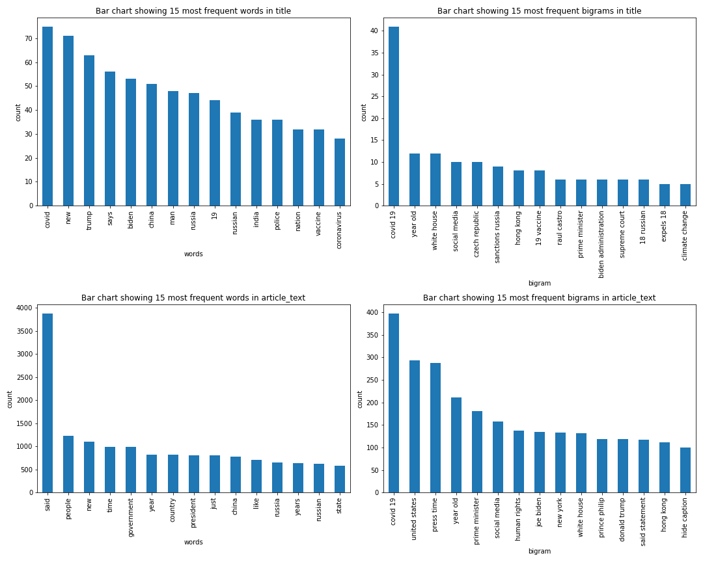

## Contents:  

- [Overview](#Overview)  
- [Problem Statement](#Problem-Statement)  
- [Executive Summary](#Executive-Summary)   
- [Conclusion](#Conclusion)  
- [Datasets](#Datasets)  
- [References](###References)  

# Overview  

"Reddit is home to thousands of communities, endless conversation, and authentic human connection. Whether you're into breaking news, sports, TV fan theories, or a never-ending stream of the internet's cutest animals, there's a community on Reddit for you."[1]  

Reddit is a social news aggregation and discussion site. Its use is increasingly ubiquitous amongst the young and the tech-savvy, as well as those who are looking to discuss various topics with like-minded peers in a user-created board called a subreddit, which is a community tailored to a specific topic.  

In particular, Reddit is home to many subreddits where news stories are posted and linked to, such as "WorldNews" or "News", and many other variants. These subreddits contain posts with the news headline, or title, and the link to the article.  

Another popular subreddit is "TheOnion", which features posts from the satirical news website "The Onion". This subreddit also consists of posts with the title and link to the article.  

This project will explore the use of k-Nearest Neighbours and RandomForestClassifier models to predict whether posts are from "TheOnion" based on the title and article text, and its success will be evaluated based on its specificity rating.  

---

# Executive summary  

The model will be trained to predict whether posts are from "TheOnion", and minimize the number of type I errors, or false positives. Hence it will aim to achieve a high specificity rating to reduce the number of false positives.  

### Webscraping Reddit  

Using the PushShift API, a custom class was created to go through a given Subreddit and create a dataset of the latest posts which have not been removed by the user, moderators, or spam filters.  

This was used to generate a dataset of over 1200 posts each from the "WorldNews" and "TheOnion" subreddits.  

Next, the Newspaper3k package was used to attempt to collect the article text from each post's link. The text was added to the dataset for each post.  

### Data Handling  

First, duplicate posts were removed from the dataset by looking at the `title` and `article_text` columns.  
Next, any posts with null values were dropped from the dataset. These were rows where there was no `article_text`.  
New columns `article_text_length`, `title_length`, `article_text_num_words`, and `title_num_words` were then created for the number of characters and number of words in `article_text` and `title`.  
Rows which had `article_text_length` that was more than 1 standard deviation less than the mean length were removed as these were mostly rows where the `article_text` was not extracted properly.  
Finally, the target feature was changed from text to binary, to 0 for `theonion` and 1 for `worldnews` and the dataset was split into a `train` set and `test` set.  

### Exploratory Data Analysis & Feature Engineering  

First, the distribution of the target was analyzed to understand if there are imbalanced classes.  
The findings was a ratio of 0.53 : 0.47 between `theonion` and `worldnews`, which is quite balanced.

Next, the numeric features `length` and `num_words` were explored for both `article_text` and `title` were plotted in histograms to identify their distributions.  
  

The histograms show that the features are right-skewed, having long tails to the right. They also have a big difference in magnitudes.  
Hence, for the kNN classifier to not be affected, these features will have to be scaled using `StandardScaler`.  

For the text features, the first exploration was to put them through `CountVectorizer` to convert the text to 0 or 1 according to their appearance in each `title` and `article_text` to identify the top frequently occurring words and bigrams.  
  

The bar charts show that the top words and bigrams appear significantly more frequently than other words. Also, they do not immediately identify which subreddit the post is from.  

Given the disparity in frequency of words and bigrams, `TfidfVectorizer` was used as this feature transformer will convert the text to a value between 0 and 1 based on their frequency of appearance, giving higher frequency words a lower weightage to reduce their bias.  
  

With `TfidfVectorizer`, the counts have now been reduced: From around 70, 40, 4000, and 400 in `CountVectorizer` to around 20, 18, 70, and 100. Hence the bias weightage of these top words have been reduced.  

### Modelling  

Before modelling, the `train` data was further split using `train_test_split` to ensure that the model can be trained and tested without data leakage from the `test` data.  

#### Baseline model

For the baseline model, the distribution of the target `subreddit` is used. Predicting all posts to be from `theonion` gives a baseline accuracy of 47.9% as 248 out of 518 posts in the `test` set were from `theonion`, which is a low accuracy score.  

Putting this in a confusion matrix, it can be visualized that the model is baseline model is wrong more often than it is right.  
  

#### Finding the best estimator and parameters  
In order to pick the best estimator and parameters, a custom class was used to do multiple gridsearches for each estimator and parameter that was specified to produce a dataframe of the min, max, mean scores for the combinations of estimators and parameters.  
  

Based on the dataframe which was sorted by the `mean_score`, it can be identified that the top performing estimator and parameters was `rfc` with `max_depth=None`, `max_features=sqrt`, and `n_estimators=400`, which had a `mean_score` of 0.95442.  

#### Fitting the best estimator and parameters  

Using the `RandomForestClassifier` with `max_depth=None`, `max_features=sqrt`, and `n_estimators=400` fit to the training dataset, train and test accuracies of the training dataset was 100% and 96.2%. Which suggests that it might be slightly overfit, but the variance error was low and it still generalized well to new data.  
When the trained model was used to predict the `test` data, it achieved an accuracy of 96.1%, which suggests that the model does indeed generalize quite well to new data.  

However, the target measure is not accuracy, but specificity as the model seeks to reduce false positives.  
Putting the predictions in a confusion matrix:  
  
It can be seen that there is a fairly low number of false negatives and even fewer false positives, which is good.  

Based on the confusion matrix, the specificity can be calculated to be 98.1% which is excellent.  

### Hypothesis testing  

Hypothesis testing was done using the McNemar's test to compare the accuracy of the baseline model with that of the trained model.  

𝐻0: There is no difference in accuracy between the baseline model and the trained model.  

𝐻𝐴: There is no difference in accuracy between the baseline model and the trained model.  

Level of significance: &alpha; = 0.05

    
Comparing the confusion matrices of the baseline model and trained model, it can be seen that while the baseline model got 248 predictions right and 270 predictions wrong, the trained model got 498 predictions right and 20 predictions wrong.  

Thus for the McNemar's test, the table used to compare the two models will look like this:  
  

Setting that as a table and putting it through the McNemar's test from `statsmodels` results in a p-value of less than 0.00001.  

Hence the null hypothesis can be rejected as it is highly improbable that the results were by chance, and the alternative hypothesis that there is a difference in accuracy between the baseline model and trained model can be accepted.

# Conclusion

In conclusion, the trained model was able to predict the subreddit based on the `title` and `article_text` with a very high specificity of 98.1%, which outperformed even its accuracy.  

The trained model outperformed the baseline model by more than double, and the null hypothesis can be rejected and the alternative hypothesis that there is a difference in accuracy between the baseline model and trained model can be accepted.  

Hence it can be concluded that the model will perform well for the needs of the drama club as requested, although there is still room for improvement in seeking a 100% specificity rate.  

The `TfidfVectorizer` could be run through a gridsearch to optimize the parameters, and more data can be collected in order to improve the model. Further, not all `article_text` could be extracted properly, and the data may not be accurate and completed, hence a better `article_text` scraper could be implemented.

---

# Datasets  

#### Data scraped from Reddit  

The following datasets were collected and used:  

`worldnews.json`  
Full data of posts collected from reddit, where spam was filtered out, in .json format.  

`worldnews.csv`  
Full dataset of posts collected from reddit, where spam was filtered out.  

`worldnews_scope.csv`  
`worldnews.csv` filtered to only `subreddit`,`title`, and `url`.  

`worldnews_full.csv`
`worldnews_scope.csv` with `article_text` added.  

`worldnews_clean.csv`  
`worldnews_full.csv` with `article_text_length`, `article_text_num_words`, `title_length`, `title_num_words`, and cleaned of duplicate rows, null rows, and rows which are too far from the mean `article_text_length`.  

`theonion.json`  
Full data of posts collected from reddit, where spam was filtered out, in .json format.  

`theonion.csv`  
Full dataset of posts collected from reddit, where spam was filtered out.  

`theonion_scope.csv`  
`theonion.csv` filtered to only `subreddit`,`title`, and `url`.  

`theonion_full.csv`
`theonion_scope.csv` with `article_text` added.  

`theonion_clean.csv`  
`theonion_full.csv` with `article_text_length`, `article_text_num_words`, `title_length`, `title_num_words`, and cleaned of duplicate rows, null rows, and rows which are too far from the mean `article_text_length`.  

`full_data.csv`  
`worldnews_clean.csv` and `theonion_clean.csv` merged

`train.csv`  
`full_data` split into training data (0.7 ratio).  

`test.csv`  
`full_data` split into testing data (0.3 ratio).

#### Data Dictionary

With the exception of features where the column names were changed, the rest of the data follows the definitions in the [Ames Housing Data Dictionary](http://jse.amstat.org/v19n3/decock/DataDocumentation.txt).

|Feature|Type|Description|
|:---|---|---|
|**subreddit**|object, int| The subreddit the post belongs to. 0 for `worldnews` and 1 for `theonion`|
|**title**|object| Title of the post in text|
|**url**|object| link to the article of the post|
|**article_text**|object| Article text of the post from its link|
|**article_text_num_words**|int| The number of words in `article_text`|
|**article_text_length**|int| The number of characters in `article_text`|
|**title_num_words**|int| The number of words in `title`|
|**title_length**|int| The number of characters in `title`|

---

### References  

[1] Reddit Inc., "Dive Into Anything". 2021. [Online]. Available: [https://www.redditinc.com](https://www.redditinc.com). [Accessed: 22-Apr-2021]
